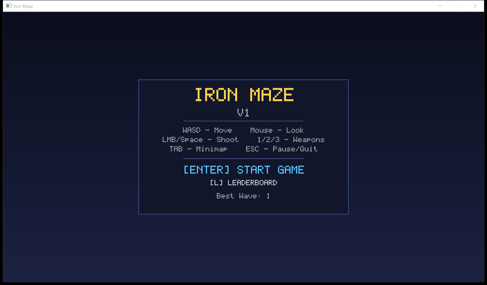
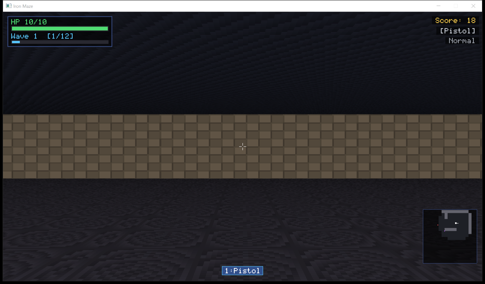

# Iron Maze

A first-person raycaster built from scratch with C++17 and SDL2. Every texture, sound effect, and pixel is generated procedurally at runtime -- zero external assets.





## Features

**Rendering**
- DDA raycasting with textured walls, floors, and ceilings
- Distance fog and billboard sprite rendering for enemies and pickups
- Custom 5x7 bitmap font rasterizer (no TTF dependency)
- Particle system for muzzle flash, hit sparks, death bursts, and explosions

**Combat**
- Three weapons: Pistol (accurate, moderate), Shotgun (6-pellet spread), Rapid-fire (fast, low damage)
- Seven enemy types with distinct behavior:

| Enemy | Trait |
|-------|-------|
| Grunt | Balanced melee chaser |
| Fast | High speed, low HP |
| Tank | High HP, heavy contact damage |
| Shooter | Ranged attacks with cooldown |
| Boss | Large, tanky, high damage (every 5th wave) |
| Exploder | Rushes in, detonates on death (damages nearby) |
| Healer | Heals nearby enemies, zero contact damage |

**Progression**
- Wave-based difficulty scaling (enemy HP, speed, and count increase each wave)
- Between-wave upgrade selection: damage, fire rate, speed, HP, full arsenal unlock, overdrive
- Four pickup types drop from killed enemies: health, damage boost, speed boost, shield
- Three difficulty modes (Easy / Normal / Hard) affecting enemy stats and score multiplier
- Local leaderboard (top 10 runs) with persistent save data via `SDL_GetPrefPath`

**HUD & UI**
- Health bar, wave progress tracker, score, weapon indicator
- Toggleable minimap with fog-of-war
- Full menu flow: main menu, difficulty select, pause overlay, upgrade selection, game over, leaderboard
- Procedurally synthesized sound effects for all game events

## Controls

| Key | Action |
|-----|--------|
| W A S D | Move |
| Mouse | Look around |
| Left Click / Space | Shoot |
| 1 / 2 / 3 | Switch weapon (if unlocked) |
| TAB | Toggle minimap |
| ESC | Pause / back / quit |
| L | Leaderboard (main menu) |
| Enter | Confirm selection |

## Build

Requires **CMake 3.16+** and **SDL2**. SDL2 can be provided via [vcpkg](https://vcpkg.io) or system install.

```bash
cmake -S . -B build
cmake --build build --config Debug
```

Run the game:

```bash
./build/Debug/iron_maze
```

Run tests (821 assertions covering math, map, particles, enemy scaling, upgrades, and more):

```bash
cd build && ctest -C Debug --output-on-failure
```

## Project Structure

```
src/
  GameConstants.hpp            Shared numeric constants (sizes, speeds, limits)
  main.cpp                     Entry point
  core/
    Game.hpp/cpp               SDL lifecycle, fixed-timestep game loop (120 Hz)
    StateMachine.hpp/cpp       Stack-based state management
  data/
    GameData.hpp/cpp           Weapon specs, enemy factories, upgrade pool
  entities/
    Components.hpp             All data structs (Player, Enemy, World, Particle, etc.)
  systems/
    AudioSystem.hpp/cpp        Procedural waveform synthesis and playback
    BitmapFont.hpp/cpp         5x7 pixel glyph rasterizer
    CombatSystem.hpp/cpp       Weapon firing, damage, wave spawning, leaderboard
    InputSystem.hpp/cpp        Keyboard and mouse event dispatch
    Map.hpp/cpp                16x16 level layout, wall queries, collision, line-of-sight
    MathUtils.hpp/cpp          Vec2 ops, angle wrapping, seedable RNG
    ParticleSystem.hpp/cpp     Spawn, update, evict (swap-and-pop) particles
    RenderSystem.hpp/cpp       Raycaster, sprites, HUD, menus, overlays
    RenderUtils.hpp/cpp        Procedural texture generation, color math
    SaveSystem.hpp/cpp         Load/save progress via SDL_GetPrefPath
    UpdateSystem.hpp/cpp       Per-frame game logic (AI, physics, pickups, state)
tests/
  test_progression.cpp         Unit tests for math, map, particles, enemies, upgrades
docs/
  screenshot_menu.png          Main menu capture
  screenshot_gameplay.png      In-game capture
```

## Notes
- This game does not have any OpenGL/Vulkan/DirectX/Metal/etc. dependencies so its completely CPU-bound. 